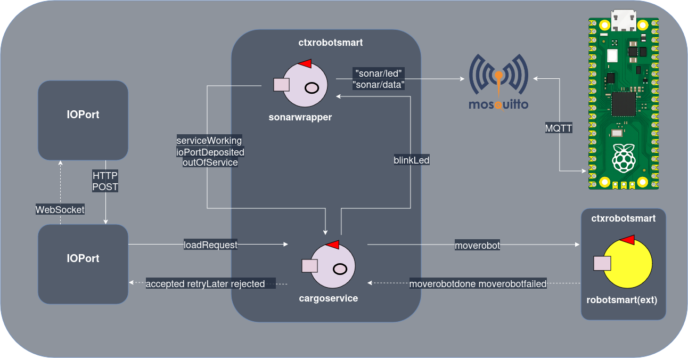

<!-- _class: lead -->
# TF2026 presentation

Made by **Claudio Marchini**
and **Cesare Tomasi**

---

# Cargoservice: requirements summary

**Goal:** _cargoservice_ automates loading containers into a ship's hold using _cargorobot_.

**Layout:** 4 storage slots + 1 staging slot (slot5, for barcode marking) + IOPort (button + display) + sonar sensor.

**Robot task:** move container **IOPort → slot5 (marking) → assigned slot**

---

# Cargoservice: requirements summary

**Request flow (button press):** 
- Occupied IOPort or "out of service" → _retrylater_
- Hold full → reject
- Else → accept, assign a free slot, go **engaged** (Led blinks), 30s to place container or system disengages

---

# Cargoservice: requirements summary

**Display always shows:** hold status + "Service working" or "Out of service" (sonar D > DFREE for ≥3s = fault)

--- 

# Sprint 0: brief outline

The goal of this sprint was to analize the requirements given to us and to translate them from natural language to a machine-readable representation. The following tasks were completed:
* the _hold_, _slot_ and _position_ entities were identified and were given matching Java interfaces (**ISlot**, **IHold**, **IPosition**) 
* the entire system was identified as _distributed_ and _heterogeneous_, which meant implementing a distributed model based on services
* the qak language was chosen to implement the services needed (**cargoservice**, **cargorobot**) for its convenience and expressivity

---

# Sprint 0: brief outline

* the load request interaction was modeled as _request/reply_
* the already developed **RobotSmart26** was chosen as the cargorobot's implementation (thanks to it being a service and developed in qak, its pathfinding algorithm and its grid based movement)
* the **IOPort** component (used by the client to interact with the system) was also defined as a web GUI

---

# Sprint 1: brief outline

This sprint was built on top of the requirement analysis of **sprint 0** and aimed to build several cardinal components of the system, in particular:
* The main **cargoservice** actor
* The **sonar** subsystem
* The **IOPort** and **pushbutton** interfaces
* Concrete Java implementations and tests of the following interfaces: **ISlot**, **IHold**, **IPosition** 

---

# Sprint 1: brief outline

**In more detail**:

* the sonar hw module was connected to a _Raspberry Pi Pico W_ and a python script for communication with both it and the cargoservice actor via _MQTT_ (chosen for modularity and lightweightness) was developed
* the IOPort web GUI was finalized (**WebSocket** was chosen over a HTTP request-response style interaction because the component has to mantain the current status of the system at any moment)

---

# Sprint 1: brief outline

* the message format used was defined following the protobook documentation and the actor **sonarwrapper** was introduced to to have a single point where the distance is parsed (making it more robust and easily adjustable in the future) 
* the current version of the _cargoservice_ actor was now capable of communicating with both working subsystems
* a _Dockerfile_ to easily deploy the various components on different nodes was also developed

---

# Sprint 2: brief outline

This sprint was built on top of the work of **sprint 1** and aimed to integrate the last component of the system: the _cargorobot_.

**In more detail**:

* the *cargoservice* actor was updated and it is now capable to instruct the **RobotSmart26** (taken as is) using requests and dispatches (via TCP)
* the _aril_ language (from the docs) was used to model the basic commands of the robot's movement

---

# Sprint 2: brief outline

* the system is now entirely functional and can be tested by the user via a virtual environment containing a simulation of the robot and the hold (available as a **web page**)
* the Dockerfile was updated to handle both the _cargorobot_ and the virtual environment  

---

## Final system architecture

<!-- _class: lead -->

