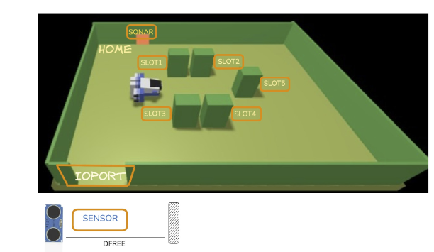

## Introduction

A _Maritime Cargo shipping company_ (from now on, simply **company**) intends to automate the operations of load of **containers** in the ship’s cargo hold (or simply hold). To this end, the company plans to employ a _Differential Drive Robot_ (from now, called **cargorobot**).
The _hold_ is a rectangular, flat are a with an Input/Output port (**IOPort**). The area provides `4 slots` to store the containers and a slot named **slot5**.



In the picture above:

- The **slots1-4** depict the hold areas reserved to store one _container_ each,
- The **slots5** depicts an area, where the _cargorobot_ must temporarily store a container, before to place it in one of
  the _slots1-4_. During temporary storage, a ‘marker’ device labels the container with an identification barcode and
  signals when this marking activity is completed.
- The **IOPort** is a device with a **pushbutton** and a **display**. The _pushbutton_ is pressed by the customer in order
  to to send a request to load a container on the cargo. The _display_ is used to show the answer to the request and
  to show the current state of the _hold_.
- The **sensor** associated to the _IOPort_ is a device (a _sonar_) used to detect the presence of a container, when it
  measures a distance `D`, such that `D < DFREE/2`, during a reasonable time (e.g. `3` secs).

## Requirements

The company asks us to build service named **cargoservice** that should work as follows.
The _cargoservice_ is able to receive a **request to load** a container sent by some customer by using the _pushbutton_ of the _IOPort_.

- It sends the answer `retrylater`, if the **IOPort** is currently occupied by a container or if the system is _Out of service_
- It rejects the request when the hold is already full, i.e. the `slots1-4` are already occupied.
- Otherwise, it considers the system as _engaged_, detects a free slot and returns as answer the name of such a reserved slot. While engaged, the system must blink a Led.

When the _request to load_ is accepted, the customer must move the container in the _sensor_ area within prefixed amount of time (e.g. 30 secs), otherwise the systems becomes **disengaged**. Then, the _cargoservice_ uses the _cargorobot_ to move the container from the _IOPort_ to the _slot5_ (for marking the container) and then to the reserved slot.
The service must also show on the _display_ on the _IOPort_:

- the current state of the _hold_
- the message **‘Service working’**, when it is all is going well
- the message **‘Out of service’** if the _sonar sensor_ measures a distance `D > DFREE` for at least `3` secs (perhaps a failure of the _sonar_).

## Requirement Analysis

## Problem Analysis

The system need an actor that manages the whole flow of the application, we will call this actor **cargoservice** and will work as the main unit, which will dispath jobs to other helper services. The normal flow is:

1. It listens for a **request to load** received by the _pushbutton_
2. It checks the state of the **IOPort**, and decides which answer to send back, as defined in the [sprint 0](http://iss.signedsnow0.it/sprint0/#requirement-analysis)
3. If a slot is free, it waits for the container to be placed in the _sensor area_ and then delegates the _cargorobot_ service to move the container to **slot-5**
4. It then moves the container from **slot-5** to the reserved slot again with the use of the **cargorobot**

```qak
QActor cargoservice context ctxcargoservice {
    [# val TimeoutMillis = 30000 #]
    [# val ReservedSlot = 0 #]

    State s0 disengaged {
        // Wait for a request to load

        if [# ioport occupied #] {
            //send retrylater
        } else if [# slots occupied #] {
            //send rejected
        } else {
            //reserve slot
            //set reserved slot var
            //send accepted(slot id)
            Goto engaged
        }
    }

    State engaged {
        //call blink led service
    }
    Transition t0
        whenTime TimeoutMillis -> disengaged
        whenMessage IOPortDeposited -> moveRobot

    State moveRobot {
        // call robot service from IOPort to slot 5
        // call robot service mark container
        // call robot service from slot 5 to slot ReservedSlot

        //stop blink led service
        Goto disengaged
    }
}
```

---

The **sonar** is built with a _Raspberry Pi Pico W_ and a [HC-SR04](https://www.handsontec.com/dataspecs/HC-SR04-Ultrasonic.pdf#[{%22num%22%3A21%2C%22gen%22%3A0}%2C{%22name%22%3A%22XYZ%22}%2C34%2C799%2C0]) sonar, we need to build a wrapper service which is used to send the data to the rest of the system. Before defining the wrapper, we need to specify a few things:

- The raspberry is too lightweight to support a full JVM needed to run _qak_ directly, so we have to use either cpp or micropython as the language
- Since _qak_ is not a possibility the comunication must be implemented with a protocol, preferably one that _qak_ suports out of the box, we have chosen to use **MQTT**

```python
def connectWifi():
    #connect to wifi

    print("Connected:", wlan.ifconfig())

def connectMqtt():
    # create Mqtt client
    # connect to Mqtt broker
    return client

def measureDistance():
    # measure distance using sonar
    return distance

TRIG = Pin(3, Pin.OUT)
ECHO = Pin(2, Pin.IN)

connectWifi()
client = connectMqtt()

while True:
    try:
        d = measureDistance()
        if d is not None:
            # create formatted msg
            client.publish(TOPIC, msg.encode() )

        time.sleep(1)
    except Exception as e:
        print("Exception: ", type(e).__name__, e)
```
* We have assumed that the Board will be connected through Wifi
* The configurations parameters (Wifi SSID, Password, MQTT broker, topi, ect..) will be set in a *.env* file in order to enhance reusability.
* The *msg* will be formatted as specified by the documentation of [unibo.basicomm23-1.0](https://anatali.github.io/issLab2026/_static/docs/Protobook.pdf#chapter.9), a library developed by our software house, already used by *qak*

Then, a *qak* wrapper will be implemented to transform the raw distance data into the messages needed by our system
```qak
Event serviceWorking : serviceWorking(X)
Event outOfService : outOfService(X)

Dispatch containerInIOPort : containerInIoPort(X)

QActor sonarwrapper context ctxcargoservice {
    State s0 initial {
        // listen to the sonar messages and send the right events/dispatch
    }
}
```
We choose to make the display messages events to permit a future expansion through extensibility. The containerInIOPort, instead is a dispatch because the only receiver should be the *cargoservice* actor.

---
Since the **IOPort** has to mantain the current status of the system at any moment the web page will need a **WebSocket** connection to ensure it receives updates, also receive the state of the *hold* our implementation in the [requirement analysis](http://iss.signedsnow0.it/sprint0/#requirement-analysis) will also need a listener that will forward any change via WebSocket to all connected clients.
```js
const socket = new WebSocket('ws://localhost:8080');

const requestSpan = document.getElementById('request-result');
const statusSpan = document.getElementById('current-status');

socket.addEventListener('open', (event) => {
    //Request initial state
});

socket.addEventListener('message', (event) => {
    // Dispatch by message type and update right span
});
```
The qak observer will be similar to [demoObserver26](https://github.com/anatali/issLab2026/blob/main/qakdemo26/src/demoobserver.qaktt)

---
## Test Plans

## Project

## Testing

## Deployment

## Maintenance
